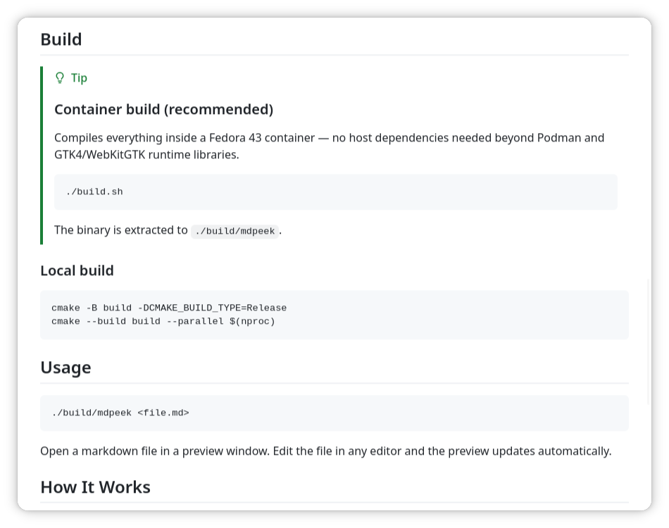
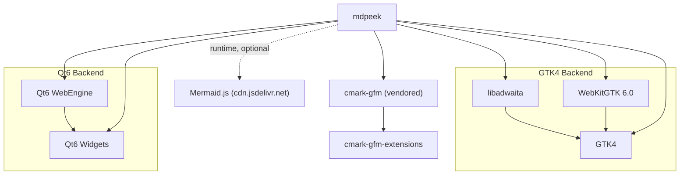

# mdpeek

[](https://copr.fedorainfracloud.org/coprs/guillermodotn/mdpeek/package/mdpeek/)


Lightweight CLI markdown previewer with GitHub-style rendering and live reload.

Renders GitHub Flavored Markdown in a native GTK4 window and automatically
refreshes when the file changes on disk.



## Features

- **GFM support:** tables, strikethrough, autolinks, task lists, tag filter
  (via cmark-gfm)
- **GitHub alerts:** renders NOTE, TIP, IMPORTANT, WARNING, and CAUTION
  callouts with icons and colours
- **Mermaid diagrams:** fenced code blocks tagged `mermaid` are rendered as
  diagrams
- **Local images:** relative and absolute image paths are resolved and
  displayed correctly, including paths with spaces or special characters
- **Live reload:** watches the file for changes and re-renders automatically
- **GitHub-style rendering:** pixel-perfect GitHub CSS rendered via the system webview
- **Lightweight:** GTK4 backend uses WebKitGTK (~30MB) instead of Chromium (~261MB)
- **Scroll preservation:** maintains scroll position across reloads
- **Atomic save handling:** correctly handles editors that save via
  write-tmp + rename

> [!NOTE]
> Mermaid diagram rendering requires a network connection. The Mermaid.js
> library is loaded from cdn.jsdelivr.net at runtime.

## Backends

mdpeek supports two UI backends selected at build time:

| Backend | Flag | Webview | Weight |
|---------|------|---------|--------|
| GTK4 + WebKitGTK (default) | *(none)* | WebKitGTK 6.0 | ~30 MB |
| Qt6 + WebEngine | `--qt` / `-DMDPEEK_BACKEND=qt` | Chromium-based | ~261 MB |

The GTK4 backend is recommended for the lightest footprint. Both backends support
all features including Mermaid diagrams — the Qt6 backend explicitly enables
remote URL access so the Mermaid.js CDN script can load from a local file context.

## Prerequisites

**Container build (recommended):**

- [Podman](https://podman.io/) (or Docker)

**Local build — GTK4 backend (default):**

- CMake >= 3.16
- GCC or Clang with C++17 support
- GTK4 + libadwaita + WebKitGTK development headers
  - Fedora: `sudo dnf install gtk4-devel libadwaita-devel webkitgtk6.0-devel`
  - Ubuntu/Debian: `sudo apt install libgtk-4-dev libadwaita-1-dev libwebkitgtk-6.0-dev`
  - Arch: `sudo pacman -S gtk4 libadwaita webkitgtk-6.0`

**Local build — Qt6 backend:**

- CMake >= 3.16
- GCC or Clang with C++17 support
- Qt6 Widgets + WebEngineWidgets development headers
  - Fedora: `sudo dnf install qt6-qtbase-devel qt6-qtwebengine-devel`
  - Ubuntu/Debian: `sudo apt install qt6-base-dev qt6-webengine-dev`
  - Arch: `sudo pacman -S qt6-base qt6-webengine`

## Clone

```bash
git clone --recursive https://github.com/<user>/mdpeek.git
cd mdpeek
```

If you already cloned without `--recursive`:

```bash
git submodule update --init --recursive
```

## Build

> [!TIP]
> ### Container build (recommended)
>
> Compiles everything inside a Fedora 43 container — no host dependencies
> needed beyond Podman and the runtime libraries.
>
> ```bash
> ./build.sh          # GTK4 backend (default)
> ./build.sh --qt     # Qt6 backend
> ```
>
> The binary is extracted to `./build/mdpeek`.

### Local build

```bash
# GTK4 backend (default)
cmake -B build -DCMAKE_BUILD_TYPE=Release
cmake --build build --parallel $(nproc)

# Qt6 backend
cmake -B build -DCMAKE_BUILD_TYPE=Release -DMDPEEK_BACKEND=qt
cmake --build build --parallel $(nproc)
```

## Usage

```bash
./build/mdpeek <file.md>
```

Open a markdown file in a preview window. Edit the file in any editor and
the preview updates automatically.

## How It Works

- **cmark-gfm** (vendored as a Git submodule, statically linked) parses
  Markdown to HTML with GitHub Flavored Markdown extensions
- **WebKitGTK** (GTK4 backend) or **QtWebEngine** (Qt6 backend) renders the
  HTML with full GitHub CSS styling
- File monitoring uses **GFileMonitor** (GTK4) or **QFileSystemWatcher** (Qt6),
  both with a 150ms debounce to handle atomic saves from editors

## Dependencies

> [!TIP]
> (test dependency graph)
>
> The graph below is a Mermaid diagram. If it does not render, a network
> connection is required.


